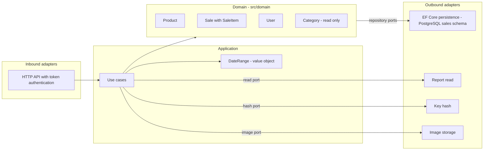

# Architecture — Simple Stock Flow

> Reconstructed **from** `spec/data-model.md` (hereafter, *the model*). First pass (challenge order 1); the closure (order 6) is in §10.
> **How to cite:** `[§2.3]` = section of the model · `[FK-3]`, `[Q9]`, `[D-04]`, `[T-20]`, `[ADR-002]`, `[DP-03]`, `[Art. X]` = identifiers that the model defines and that are not redefined here.
> **Assumption (S-nn)** = does not come from the model; the complete list is in §9.

## 1. How the model was read

1. Every rule carries one of three marks: **engine**, **domain only** or **pending (T-xx)** [«How to read this document»]. They are respected as is: a «domain only» rule is not presented as guaranteed.
2. If the document contradicts the engine, **the engine wins** [header; Art. X]. There is no access to the engine from this repository, so when the model contradicts itself, the most recently dated mark is used (§13, 2026-09-20) and the contradiction is recorded (DM-n, §10.3).
3. What the model does not say is not asserted: it is marked as an assumption.

## 2. Architectural style

| Decision | What the model says | Source |
|---|---|---|
| Hexagonal architecture (ports and adapters) | «By design of the hexagon»; hash port; report read port; the persistence adapter is where the mapping lives; paths `src/domain/` and `src/adapters/outbound/persistence/Configurations/` | [§2.5], [§1 Report, D-06], [§0], [§12] |
| Rich domain with aggregates (tactical DDD) | Three aggregate roots and one reference entity | [§2.1–§2.5] |
| A single system, a single database, a single schema | «The `sales` schema groups the entire system» → modular monolith (S-02) | [§3] |
| Persistence | PostgreSQL 16, EF Core (shadow properties, global filter, migrations), C# | [header], [§2.2], [§3.2], [§0] |
| Image binaries outside the database | External storage; the database stores only an opaque key | [§1 Image, D-08], [§7.1] |
| The schema is owned only by migrations | Nothing else writes DDL | [§3.2, ADR-001] |

## 3. Parts view

The code dependency always points towards the domain; the adapters implement the ports.

## 4. Aggregates

| Aggregate | Root | Inside | Value objects | Protects | Source |
|---|---|---|---|---|---|
| Catalog | `Product` | — | `Money`, image key | R-01…R-07 | [§2.2] |
| Sales | `Sale` | `SaleItem` (`internal` constructor: only `Sale.AddItem` creates it) | `Money`, `Quantity` | R-08…R-17 | [§2.3], [§2.4] |
| Identity | `User` | — | role (`Roles`) | R-18…R-22 | [§2.5] |
| Reference | `Category`: **not a root**, no lifecycle, read-only repository | — | — | R-23 | [§2.1] |

- Value objects **do not have a table**: they live in their owner's row [§2, D-07].
- Between aggregates, referencing is done by **root identity**: `product→category`, `sale_item→product`, `sale→user` [§5, cardinalities].
- There are no report, audit, or counter tables [§2].

## 5. Ports

| Port | Direction | What it offers | Pattern | Source |
|---|---|---|---|---|
| `Product` repository | outbound | search (partial text, category, active only, order by name, paginated and with count); by id; **by batch of active ids** (read prior to writing stock); save with concurrency token | Q1, Q2, Q3 | [§6.1], [D-04] |
| `Category` repository | outbound, **read only** | list by name; by id. No method creates, renames, or deletes | Q4, Q5 | [§2.1], [§6.1] |
| `Sale` repository | outbound | sale with its lines; sales by range (paginated, with count); save confirmed sale. No editing or deleting | Q6, Q7 | [§6.1], [§2.3] |
| Sales by range **unpaginated** | — | **Remove from port**: has no consumer | Q8 | [§6.1] |
| `User` repository | outbound | by exact name (each login) | Q10 | [§6.1] |
| Report read port | outbound | aggregation by product over a range, **calculated in the engine**, returning a read model | Q9 | [§1], [D-06], [§6.1] |
| Hash port | outbound | produce and verify the hash; only place that sees the cleartext key | — | [§2.5], [§9.2], [D-09] |
| Image storage (S-10) | outbound | save and delete binaries by opaque key | — | [§1], [§7.1], [D-08] |
| HTTP API | inbound | token authentication and role authorization; the API contract is not in the model (S-11) | — | [§13 D-3], [§3], [§12] |

## 6. Where each rule lives

| R | Rule | Where it lives | Mark | Source |
|---|---|---|---|---|
| R-01 | Mandatory product name, not empty, trimmed | `Product.Rename`; the engine only requires `NOT NULL` | domain only | [§2.2] |
| R-02 | `price > 0` | `Product.ChangePrice` (`Money` allows 0) | domain only → T-20 | [§2.2], [§4] |
| R-03 | `stock >= 0` after any operation | `Product.Withdraw`/`Restock` + `ck_product_stock_non_negative` | **engine** | [§2.2], [§4] |
| R-04 | Withdrawing more stock than available fails | `Product.Withdraw` (process rule, not a `CHECK`) | domain only | [§2.2] |
| R-05 | Mandatory and existing category | `FK_product_category_category_id` (FK-1, RESTRICT) | **engine** | [§2.2], [§5] |
| R-06 | No image = `NULL`, never an empty string | `Product.AttachImage` | domain only | [§2.2] |
| R-07 | Logical deletion, never physical deletion | `deleted_at` + global filter | **engine** (T-09; see DM-4) | [§2.2], [D-03], [§13 D-1] |
| R-08 | The sale records who performs it | `Sale` constructor; `NOT NULL` | domain only | [§2.3] |
| R-09 | At least one line to be confirmed | `Sale.EnsureConfirmable` (would require a deferred trigger) | domain only | [§2.3] |
| R-10 | A product is not repeated in a sale | `Sale.AddItem` + unique index `(sale_id, product_id)` | domain and **engine** (T-20; DM-5) | [§2.3], [§4] |
| R-11 | Deducting stock and adding the line are **a single operation** | `Sale.AddItem` calls `Product.Withdraw` | domain only | [§2.3] |
| R-12 | Immutable sale | there is no editing or deleting port | domain only (by absence) | [§2.3], [§7.1] |
| R-13 | The line requires a product | `NOT NULL` + FK-3 (RESTRICT) | **engine** (T-20; DM-5) | [§2.4], [§5] |
| R-14 | `quantity > 0` | `Quantity` constructor | domain only → T-20 | [§2.4] |
| R-15 | Line name and price frozen | `Sale.AddItem` copies from `Product` | domain only | [§2.4], [§1] |
| R-16 | Category name frozen, **no FK on purpose** | `sale_item.category_name NOT NULL` | **engine** (T-11; DM-3) | [§2.4], [D-06], [ADR-004] |
| R-17 | The line does not exist outside its sale | FK-2 (CASCADE) + `sale_id NOT NULL` | **engine** (T-20; DM-5) | [§2.4], [§5] |
| R-18 | Mandatory and unique user | constructor + `IX_user_username` | **engine** (uniqueness) | [§2.5] |
| R-19 | User in lowercase and trimmed | `User.NormalizeUsername` | domain only → T-20 | [§2.5] |
| R-20 | Mandatory and not empty hash | `User` constructor; `NOT NULL` | domain only | [§2.5] |
| R-21 | `role` in `('admin','seller')` | `Roles.IsValid` | domain only → T-20 | [§2.5], [§9.2] |
| R-22 | The domain never sees the cleartext key | hash port | by design of the hexagon | [§2.5], [D-09] |
| R-23 | Category: mandatory, not empty and unique name | `Category.Rename` (domain only → T-20); `IX_category_name` (engine) | mixed | [§2.1] |
| R-24 | Total and subtotal are calculated, not stored | `Sale.Total`, `SaleItem.Subtotal`; no column | domain | [§1], [Art. VII] |
| R-25 | Single currency; no currency column | no table has it; the guard in `Sale.AddItem` is **pending (T-05)** | design | [§3], [§2.3], [D-05] |
| R-26 | Amount to 2 decimals, `AwayFromZero` | `Money` and `numeric(18,2)`, which change **together** | domain + engine | [§2.2] |
| R-27 | Date range: the end cannot be earlier than the start | application layer value object, no table | application | [§1] |
| R-28 | No column with `DEFAULT` | values are set by the domain | engine (by absence) | [§3] |
| R-29 | `timestamptz` timestamps, server in UTC | column type | engine | [§3] |
| R-30 | When deleting a binary: nullify `image_key`, commit, and **then** delete the binary; no atomicity | application + external storage | procedure | [§7.1] |
| R-31 | The initial `admin` is created on startup with environment credentials; nobody grants `admin` at runtime | application startup + API | outside the schema | [§9.2], [§11 H-3], [D-10], [DP-04] |
| R-32 | The report groups by the frozen category value | read port query | query | [§11.1], [ADR-004] |
| R-33 | The report is not broken down by seller | read port | decision | [DP-02], [§7.1] |

**Declared debt:** the five «domain only» value rules (R-02, R-14, R-19, R-21 and the not empty of R-23) drop to the engine in T-20 [§4]. Model criteria: if a constraint fails, *something wrote outside the adapter* [ADR-002, §2].

## 7. Consistency and concurrency

- **Optimistic concurrency:** Postgres `xmin` as a token, exposed as a shadow property (T-10) [§3, D-04].
- **Last barrier:** `ck_product_stock_non_negative` [§2.2, ADR-002].
- **Contention point:** Q3, the product read that precedes the stock write [§6.1].
- **Operation between two aggregates:** `Sale.AddItem` modifies `Product` and `Sale` as «a single operation» [R-11]. The model does not say how it materializes: a database transaction is assumed (S-04) and that, in case of a conflict, the losing write fails (S-14).
- **Binaries:** the storage does not participate in the database transaction, which is why atomicity is not promised [R-30].

## 8. Persistence, security and privacy

- **`sales` schema**, five singular tables: `category`, `product`, `sale`, `sale_item`, `user`. What goes to singular is the table, not the schema. `user` does not need quotes because it is qualified [§0].
- **Naming convention:** what EF generates keeps its style (`PK_`, `IX_`, `FK_`); what is handwritten (the `CHECK`s) goes in `snake_case`: `ck_{table}_{rule}` [§3.1].
- **Applied migrations:** four, from `InitialSchema` to `RenameTablesToSingular` [§3.2].
- **Seed:** the five categories go in the initial migration with fixed ids. The initial administrator is **not** seeded from SQL [§9.1–§9.2].
- **Indexes:** the access ones and their state (exist / missing) are in [§6.2]. Three are missing (T-13): the partial `(category_id, name)`, the trigram one and the composite unique with `INCLUDE`. `pg_trgm` is installed by the migration that creates the index itself, never `db/init/` [§6.2].
- **Privacy attribute by attribute:** `username` is personal data; `password_hash` is a secret (never in logs, responses or errors, and is never indexed); there is no end-customer data [§7].

## 9. Assumptions

| S | Assumption | Why it is an assumption |
|---|---|---|
| S-01 | Hardware/supplies store | Only inferred from the seeded categories [§9.1] |
| S-02 | Modular monolith: one API and one database | The model only says the schema groups the system [§3] |
| S-03 | Permission matrix by role (see `04-requirements`) | The model only sets the registration of sellers [§11 H-3, §13 D-3] |
| S-04 | Registering a sale is a database transaction | The model says «a single operation» [§2.3] |
| S-05 | Invalid credentials: generic message | The model does not define the message |
| S-06 | Domain events are derived from operations | The model does not define events nor persist them [§2, §8] |
| S-07 | Restocking requires quantity > 0 | Positivity is only declared for sale lines [§1] |
| S-08 | There is no reactivating products nor changing role/editing users | The model does not define those operations |
| S-09 | No numerical performance thresholds | The model prioritizes by frequency, without figures [§6.1] |
| S-10 | An image storage port exists | The model speaks of «external storage» [§1, §7.1] |
| S-11 | The API contract is outside the model | Lives in `api-contract.md`, not delivered [§12] |
| S-12 | The sale is built and confirmed before being persisted | Interpretation of «to be able to be confirmed» [§2.3] |
| S-13 | Report of a range without sales → empty result | The model does not define it |
| S-14 | Concurrency conflict → the losing write fails and the client retries | The model does not define the response |
| S-15 | Success indicators are derived from invariants | The model does not define business metrics |

## 10. Closure (order 6): check against the model and against `01`–`04`

### 10.1 Is each section of the model collected?

| Model | Where it is collected |
|---|---|
| §0 Names | this §8 |
| §1 Glossary | `02-domain` §1 |
| §2 Entities and invariants | this §4 and §6; `02-domain` §3 |
| §3 Physical model | this §8 |
| §4 Constraints | this §6 |
| §5 Foreign keys | this §6; `02-domain` §5 |
| §6 Accesses and indexes | this §5 and §8; `04` HU-07…HU-12, RNF-08 |
| §7 Privacy and retention | this §8; `04` RNF-05, RNF-07 |
| §8 No audit | `01-context` §4 (out of scope) |
| §9 Seed | this §8; `04` HU-02, HU-08 |
| §10 Verification | `04` RNF-09; this §10.5 |
| §11 Gaps | `02-domain` §9; `03-product` §8 |
| §12 Signature and exclusions | `01-context` §4 |
| §13 Debt | this §10.3 |

### 10.2 Does each story have an aggregate and port?

| US | Aggregate(s) | Outbound ports | Pattern |
|---|---|---|---|
| HU-01 Login | `User` | `User` repository, hash | Q10 |
| HU-02 Register sellers | `User` | `User` repository, hash | Q10 |
| HU-03 Create product | `Product`, `Category` | `Product` repository, `Category` repository, images | Q5 |
| HU-04 Modify product | `Product`, `Category` | `Product` repository, `Category` repository, images | Q2, Q5 |
| HU-05 Restock | `Product` | `Product` repository | Q2 |
| HU-06 Deactivate | `Product` | `Product` repository, images | Q2 |
| HU-07 Search products | `Product` | `Product` repository | Q1 |
| HU-08 Consult categories | `Category` | `Category` repository | Q4, Q5 |
| HU-09 Register sale | `Sale`, `Product`, `User` | `Sale` repository, `Product` repository | Q3 |
| HU-10 Consult sale | `Sale` | `Sale` repository | Q6 |
| HU-11 List sales | `Sale` | `Sale` repository | Q7 |
| HU-12 Report | read model | report read port | Q9 |

**Result:** Q1–Q7, Q9 and Q10 have a consumer. **Q8 does not, and it is deliberate** [§6.1]. No US asks for something that the model excludes.

### 10.3 Model discrepancies (the engine rules; verify with §10 of the model)

| # | What is contradicted | How it is treated here |
|---|---|---|
| DM-1 | Column count: «22» in §3, §0 and §12 versus «21» in §10.1, in the anchor of §8 and in the `xmin` note | 21 is the literal output from 2026-09-19. 22 equals 21 + `deleted_at` (T-09, §13 D-1). 22 is used as the current state |
| DM-2 | `product.category_name` appears in the `product` table of §3, but DP-03 and §1 limit `Product` to name, price, stock, category and image, and §2.4, §5 and §11.1 place it in `sale_item` | It is treated as a `sale_item` column. It is considered a placement error in the model |
| DM-3 | `sale_item.category_name`: «engine (T-11)» in §2.4, but «pending (T-11)» in the `sale_item` table of §3 | It is documented as engine [§2.4] and pointed out. Verify with the query of §10.1 |
| DM-4 | `deleted_at`: engine in §2.2, §3 and §13 D-1, but «pending T-09» in §6.2, §6.3 and §7.1 | §13 (2026-09-20) prevails: engine |
| DM-5 | FK-3, `sale_id NOT NULL` and the composite unique: engine in §2.3, §2.4, §4 (rows), §5 and §13 D-2; but «eight constraints» in the header of §4, «today there are two» in §5, «missing (T-13)» in §6.2 and outputs of §10 without them. Additionally, the owner of the composite is T-13 in §6.2 and T-20 in §4 | §13 D-2 prevails: engine. The outputs of §10 are prior to 2026-09-20 and must be repeated |
| DM-6 | `spec.md` CA-06.1 («one row per product») contradicts the decision of §11.1 | **Pending decision from the owner** [§11.1]. HU-12 is written with the decision of §11.1 |

### 10.4 Debt and pending items carried by the architecture

- **Open:** T-05 (currency guard), T-11 (see DM-3), T-12 (`sold_by_user_id` and FK-4), T-13 (indexes) and T-20 (partial: missing the `CHECK`s for R-02, R-14, R-19, R-21 and R-23).
- **Gaps with owner:** H-2 (orphan image binary) [§11].
- **Measured defect, not fixed:** A-7/DP-01, the tie-breaker of the product name in the report [§11.1].

### 10.5 What is missing to consider the architecture closed

1. Repeat the three queries from §10 of the model and reconcile DM-1…DM-5.
2. Owner's decision on DM-6.
3. Confirm assumptions S-03 (permissions), S-04 (transaction) and S-14 (conflict).
