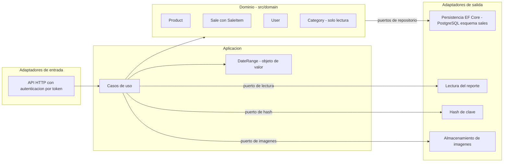

# Arquitectura — Simple Stock Flow

> Reconstruida **desde** `spec/data-model.md` (en adelante, *el modelo*). Primera pasada (orden 1 del reto); el cierre (orden 6) está en la §10.
> **Cómo se cita:** `[§2.3]` = sección del modelo · `[FK-3]`, `[Q9]`, `[D-04]`, `[T-20]`, `[ADR-002]`, `[DP-03]`, `[Art. X]` = identificadores que el modelo define y que aquí no se redefinen.
> **Supuesto (S-nn)** = no sale del modelo; la lista completa está en la §9.

## 1. Cómo se leyó el modelo

1. Toda regla lleva una de tres marcas: **motor**, **solo dominio** o **pendiente (T-xx)** [«Cómo se lee este documento»]. Se respetan tal cual: una regla «solo dominio» no se presenta como garantizada.
2. Si el documento contradice al motor, **gana el motor** [encabezado; Art. X]. No hay acceso al motor desde este repositorio, así que cuando el modelo se contradice a sí mismo se usa la marca fechada más recientemente (§13, 2026-09-20) y la contradicción se registra (DM-n, §10.3).
3. Lo que el modelo no dice no se afirma: se marca como supuesto.

## 2. Estilo arquitectónico

| Decisión | Qué dice el modelo | Fuente |
|---|---|---|
| Arquitectura hexagonal (puertos y adaptadores) | «Por diseño del hexágono»; puerto de hash; puerto de lectura del reporte; el adaptador de persistencia es donde vive el mapeo; rutas `src/domain/` y `src/adapters/outbound/persistence/Configurations/` | [§2.5], [§1 Reporte, D-06], [§0], [§12] |
| Dominio rico con agregados (DDD táctico) | Tres raíces de agregado y una entidad de referencia | [§2.1–§2.5] |
| Un solo sistema, una sola base, un solo esquema | «El esquema `sales` agrupa el sistema entero» → monolito modular (S-02) | [§3] |
| Persistencia | PostgreSQL 16, EF Core (propiedades sombra, filtro global, migraciones), C# | [encabezado], [§2.2], [§3.2], [§0] |
| Binarios de imagen fuera de la base | Almacenamiento externo; la base guarda solo una clave opaca | [§1 Imagen, D-08], [§7.1] |
| El esquema lo poseen solo las migraciones | Nada más escribe DDL | [§3.2, ADR-001] |

## 3. Vista de piezas

La dependencia de código apunta siempre hacia el dominio; los adaptadores implementan los puertos.

## 4. Agregados

| Agregado | Raíz | Dentro | Objetos de valor | Protege | Fuente |
|---|---|---|---|---|---|
| Catálogo | `Product` | — | `Money`, clave de imagen | R-01…R-07 | [§2.2] |
| Ventas | `Sale` | `SaleItem` (constructor `internal`: solo `Sale.AddItem` lo crea) | `Money`, `Quantity` | R-08…R-17 | [§2.3], [§2.4] |
| Identidad | `User` | — | rol (`Roles`) | R-18…R-22 | [§2.5] |
| Referencia | `Category`: **no es raíz**, sin ciclo de vida, repositorio de solo lectura | — | — | R-23 | [§2.1] |

- Los objetos de valor **no tienen tabla**: viven en la fila de su dueño [§2, D-07].
- Entre agregados se referencia por **identidad de la raíz**: `product→category`, `sale_item→product`, `sale→user` [§5, cardinalidades].
- No existen tablas de reporte, auditoría ni contadores [§2].

## 5. Puertos

| Puerto | Dirección | Qué ofrece | Patrón | Fuente |
|---|---|---|---|---|
| Repositorio de `Product` | salida | buscar (texto parcial, categoría, solo activos, orden por nombre, paginado y con conteo); por id; **por lote de ids activos** (lectura previa a escribir stock); guardar con testigo de concurrencia | Q1, Q2, Q3 | [§6.1], [D-04] |
| Repositorio de `Category` | salida, **solo lectura** | listar por nombre; por id. Ningún método crea, renombra ni borra | Q4, Q5 | [§2.1], [§6.1] |
| Repositorio de `Sale` | salida | venta con sus líneas; ventas por rango (paginado, con conteo); guardar venta confirmada. Sin editar ni borrar | Q6, Q7 | [§6.1], [§2.3] |
| Ventas por rango **sin paginar** | — | **Retirar del puerto**: no tiene consumidor | Q8 | [§6.1] |
| Repositorio de `User` | salida | por nombre exacto (cada inicio de sesión) | Q10 | [§6.1] |
| Puerto de lectura del reporte | salida | agregación por producto sobre un rango, **calculada en el motor**, que devuelve un modelo de lectura | Q9 | [§1], [D-06], [§6.1] |
| Puerto de hash | salida | producir y verificar el hash; único lugar que ve la clave en claro | — | [§2.5], [§9.2], [D-09] |
| Almacenamiento de imágenes (S-10) | salida | guardar y borrar binarios por clave opaca | — | [§1], [§7.1], [D-08] |
| API HTTP | entrada | autenticación por token y autorización por rol; el contrato de la API no está en el modelo (S-11) | — | [§13 D-3], [§3], [§12] |

## 6. Dónde vive cada regla

| R | Regla | Dónde vive | Marca | Fuente |
|---|---|---|---|---|
| R-01 | Nombre de producto obligatorio, no vacío, recortado | `Product.Rename`; el motor solo exige `NOT NULL` | solo dominio | [§2.2] |
| R-02 | `price > 0` | `Product.ChangePrice` (`Money` admite 0) | solo dominio → T-20 | [§2.2], [§4] |
| R-03 | `stock >= 0` tras cualquier operación | `Product.Withdraw`/`Restock` + `ck_product_stock_non_negative` | **motor** | [§2.2], [§4] |
| R-04 | Retirar más stock del disponible falla | `Product.Withdraw` (regla de proceso, no es un `CHECK`) | solo dominio | [§2.2] |
| R-05 | Categoría obligatoria y existente | `FK_product_category_category_id` (FK-1, RESTRICT) | **motor** | [§2.2], [§5] |
| R-06 | Sin imagen = `NULL`, nunca cadena vacía | `Product.AttachImage` | solo dominio | [§2.2] |
| R-07 | Baja lógica, nunca borrado físico | `deleted_at` + filtro global | **motor** (T-09; ver DM-4) | [§2.2], [D-03], [§13 D-1] |
| R-08 | La venta registra quién la realiza | constructor de `Sale`; `NOT NULL` | solo dominio | [§2.3] |
| R-09 | Al menos una línea para confirmarse | `Sale.EnsureConfirmable` (exigiría un disparador diferido) | solo dominio | [§2.3] |
| R-10 | Un producto no se repite en una venta | `Sale.AddItem` + índice único `(sale_id, product_id)` | dominio y **motor** (T-20; DM-5) | [§2.3], [§4] |
| R-11 | Descontar stock y añadir la línea son **una sola operación** | `Sale.AddItem` llama a `Product.Withdraw` | solo dominio | [§2.3] |
| R-12 | Venta inmutable | no existe puerto de edición ni de borrado | solo dominio (por ausencia) | [§2.3], [§7.1] |
| R-13 | La línea exige un producto | `NOT NULL` + FK-3 (RESTRICT) | **motor** (T-20; DM-5) | [§2.4], [§5] |
| R-14 | `quantity > 0` | constructor de `Quantity` | solo dominio → T-20 | [§2.4] |
| R-15 | Nombre y precio de la línea congelados | `Sale.AddItem` copia de `Product` | solo dominio | [§2.4], [§1] |
| R-16 | Nombre de categoría congelado, **sin FK a propósito** | `sale_item.category_name NOT NULL` | **motor** (T-11; DM-3) | [§2.4], [D-06], [ADR-004] |
| R-17 | La línea no existe fuera de su venta | FK-2 (CASCADE) + `sale_id NOT NULL` | **motor** (T-20; DM-5) | [§2.4], [§5] |
| R-18 | Usuario obligatorio y único | constructor + `IX_user_username` | **motor** (unicidad) | [§2.5] |
| R-19 | Usuario en minúsculas y recortado | `User.NormalizeUsername` | solo dominio → T-20 | [§2.5] |
| R-20 | Hash obligatorio y no vacío | constructor de `User`; `NOT NULL` | solo dominio | [§2.5] |
| R-21 | `role` en `('admin','seller')` | `Roles.IsValid` | solo dominio → T-20 | [§2.5], [§9.2] |
| R-22 | El dominio nunca ve la clave en claro | puerto de hash | por diseño del hexágono | [§2.5], [D-09] |
| R-23 | Categoría: nombre obligatorio, no vacío y único | `Category.Rename` (solo dominio → T-20); `IX_category_name` (motor) | mixta | [§2.1] |
| R-24 | Total y subtotal se calculan, no se almacenan | `Sale.Total`, `SaleItem.Subtotal`; sin columna | dominio | [§1], [Art. VII] |
| R-25 | Monomoneda; sin columna de moneda | ninguna tabla la tiene; la guarda en `Sale.AddItem` está **pendiente (T-05)** | diseño | [§3], [§2.3], [D-05] |
| R-26 | Importe a 2 decimales, `AwayFromZero` | `Money` y `numeric(18,2)`, que cambian **juntos** | dominio + motor | [§2.2] |
| R-27 | Rango de fechas: el fin no puede ser anterior al inicio | objeto de valor de la capa de aplicación, sin tabla | aplicación | [§1] |
| R-28 | Ninguna columna con `DEFAULT` | los valores los pone el dominio | motor (por ausencia) | [§3] |
| R-29 | Marcas de tiempo `timestamptz`, servidor en UTC | tipo de columna | motor | [§3] |
| R-30 | Al borrar un binario: anular `image_key`, confirmar, y **después** borrar el binario; sin atomicidad | aplicación + almacenamiento externo | procedimiento | [§7.1] |
| R-31 | El `admin` inicial lo crea el arranque con credenciales de entorno; nadie otorga `admin` en ejecución | arranque de la aplicación + API | fuera del esquema | [§9.2], [§11 H-3], [D-10], [DP-04] |
| R-32 | El reporte agrupa por el valor congelado de categoría | consulta del puerto de lectura | consulta | [§11.1], [ADR-004] |
| R-33 | El reporte no se desglosa por vendedor | puerto de lectura | decisión | [DP-02], [§7.1] |

**Deuda declarada:** las cinco reglas «solo dominio» de valor (R-02, R-14, R-19, R-21 y el no vacío de R-23) bajan al motor en T-20 [§4]. Criterio del modelo: si una restricción salta, *algo escribió fuera del adaptador* [ADR-002, §2].

## 7. Consistencia y concurrencia

- **Concurrencia optimista:** `xmin` de Postgres como testigo, expuesto como propiedad sombra (T-10) [§3, D-04].
- **Última barrera:** `ck_product_stock_non_negative` [§2.2, ADR-002].
- **Punto de contención:** Q3, la lectura de productos que precede a la escritura de stock [§6.1].
- **Operación entre dos agregados:** `Sale.AddItem` modifica `Product` y `Sale` como «una sola operación» [R-11]. El modelo no dice cómo se materializa: se asume una transacción de base de datos (S-04) y que, ante un conflicto, la escritura perdedora falla (S-14).
- **Binarios:** el almacenamiento no participa en la transacción de la base, por eso no se promete atomicidad [R-30].

## 8. Persistencia, seguridad y privacidad

- **Esquema `sales`**, cinco tablas en singular: `category`, `product`, `sale`, `sale_item`, `user`. Lo que pasa a singular es la tabla, no el esquema. `user` no necesita comillas porque va cualificado [§0].
- **Convención de nombres:** lo que genera EF conserva su estilo (`PK_`, `IX_`, `FK_`); lo escrito a mano (los `CHECK`) va en `snake_case`: `ck_{tabla}_{regla}` [§3.1].
- **Migraciones aplicadas:** cuatro, de `InitialSchema` a `RenameTablesToSingular` [§3.2].
- **Semilla:** las cinco categorías van en la migración inicial con ids fijos. El administrador inicial **no** se siembra desde SQL [§9.1–§9.2].
- **Índices:** los de acceso y su estado (existen / faltan) están en [§6.2]. Faltan tres (T-13): el parcial `(category_id, name)`, el de trigramas y el compuesto único con `INCLUDE`. `pg_trgm` la instala la propia migración que crea el índice, nunca `db/init/` [§6.2].
- **Privacidad atributo por atributo:** `username` es dato personal; `password_hash` es secreto (nunca en logs, respuestas ni errores, y nunca se indexa); no hay datos de cliente final [§7].

## 9. Supuestos

| S | Supuesto | Por qué es supuesto |
|---|---|---|
| S-01 | Comercio de ferretería/suministros | Solo se infiere de las categorías sembradas [§9.1] |
| S-02 | Monolito modular: una API y una base | El modelo solo dice que el esquema agrupa el sistema [§3] |
| S-03 | Matriz de permisos por rol (ver `04-requirements`) | El modelo solo fija el alta de vendedores [§11 H-3, §13 D-3] |
| S-04 | Registrar una venta es una transacción de base de datos | El modelo dice «una sola operación» [§2.3] |
| S-05 | Credenciales inválidas: mensaje genérico | El modelo no define el mensaje |
| S-06 | Los eventos de dominio se derivan de las operaciones | El modelo no define eventos ni los persiste [§2, §8] |
| S-07 | Reponer stock exige cantidad > 0 | La positividad solo se declara para líneas de venta [§1] |
| S-08 | No hay reactivar productos ni cambiar rol/editar usuarios | El modelo no define esas operaciones |
| S-09 | Sin umbrales numéricos de rendimiento | El modelo prioriza por frecuencia, sin cifras [§6.1] |
| S-10 | Existe un puerto de almacenamiento de imágenes | El modelo habla de «almacenamiento externo» [§1, §7.1] |
| S-11 | El contrato de la API está fuera del modelo | Vive en `api-contract.md`, no entregado [§12] |
| S-12 | La venta se construye y se confirma antes de persistirse | Interpretación de «para poder confirmarse» [§2.3] |
| S-13 | Reporte de un rango sin ventas → resultado vacío | El modelo no lo define |
| S-14 | Conflicto de concurrencia → la escritura perdedora falla y el cliente reintenta | El modelo no define la respuesta |
| S-15 | Los indicadores de éxito se derivan de invariantes | El modelo no define métricas de negocio |

## 10. Cierre (orden 6): comprobación contra el modelo y contra `01`–`04`

### 10.1 ¿Cada sección del modelo quedó recogida?

| Modelo | Dónde se recoge |
|---|---|
| §0 Nombres | esta §8 |
| §1 Glosario | `02-domain` §1 |
| §2 Entidades e invariantes | esta §4 y §6; `02-domain` §3 |
| §3 Modelo físico | esta §8 |
| §4 Restricciones | esta §6 |
| §5 Claves foráneas | esta §6; `02-domain` §5 |
| §6 Accesos e índices | esta §5 y §8; `04` HU-07…HU-12, RNF-08 |
| §7 Privacidad y retención | esta §8; `04` RNF-05, RNF-07 |
| §8 Sin auditoría | `01-context` §4 (fuera de alcance) |
| §9 Semilla | esta §8; `04` HU-02, HU-08 |
| §10 Verificación | `04` RNF-09; esta §10.5 |
| §11 Huecos | `02-domain` §9; `03-product` §8 |
| §12 Firma y exclusiones | `01-context` §4 |
| §13 Deuda | esta §10.3 |

### 10.2 ¿Cada historia tiene agregado y puerto?

| HU | Agregado(s) | Puertos de salida | Patrón |
|---|---|---|---|
| HU-01 Iniciar sesión | `User` | repositorio `User`, hash | Q10 |
| HU-02 Alta de vendedores | `User` | repositorio `User`, hash | Q10 |
| HU-03 Crear producto | `Product`, `Category` | repositorio `Product`, repositorio `Category`, imágenes | Q5 |
| HU-04 Modificar producto | `Product`, `Category` | repositorio `Product`, repositorio `Category`, imágenes | Q2, Q5 |
| HU-05 Reponer stock | `Product` | repositorio `Product` | Q2 |
| HU-06 Dar de baja | `Product` | repositorio `Product`, imágenes | Q2 |
| HU-07 Buscar productos | `Product` | repositorio `Product` | Q1 |
| HU-08 Consultar categorías | `Category` | repositorio `Category` | Q4, Q5 |
| HU-09 Registrar venta | `Sale`, `Product`, `User` | repositorio `Sale`, repositorio `Product` | Q3 |
| HU-10 Consultar venta | `Sale` | repositorio `Sale` | Q6 |
| HU-11 Listar ventas | `Sale` | repositorio `Sale` | Q7 |
| HU-12 Reporte | modelo de lectura | puerto de lectura del reporte | Q9 |

**Resultado:** Q1–Q7, Q9 y Q10 tienen consumidor. **Q8 no, y es deliberado** [§6.1]. Ninguna HU pide algo que el modelo excluya.

### 10.3 Discrepancias del modelo (el motor manda; verificar con §10 del modelo)

| # | Qué se contradice | Cómo se trata aquí |
|---|---|---|
| DM-1 | Conteo de columnas: «22» en §3, §0 y §12 frente a «21» en §10.1, en el ancla de §8 y en la nota de `xmin` | 21 es la salida literal del 2026-09-19. 22 equivale a 21 + `deleted_at` (T-09, §13 D-1). Se usa 22 como estado actual |
| DM-2 | `product.category_name` aparece en la tabla `product` de §3, pero DP-03 y §1 limitan `Product` a nombre, precio, stock, categoría e imagen, y §2.4, §5 y §11.1 la ubican en `sale_item` | Se trata como columna de `sale_item`. Se considera un error de colocación del modelo |
| DM-3 | `sale_item.category_name`: «motor (T-11)» en §2.4, pero «pendiente (T-11)» en la tabla `sale_item` de §3 | Se documenta como motor [§2.4] y se señala. Verificar con la consulta de §10.1 |
| DM-4 | `deleted_at`: motor en §2.2, §3 y §13 D-1, pero «pendiente T-09» en §6.2, §6.3 y §7.1 | Prevalece §13 (2026-09-20): motor |
| DM-5 | FK-3, `sale_id NOT NULL` y el compuesto único: motor en §2.3, §2.4, §4 (filas), §5 y §13 D-2; pero «ocho restricciones» en el encabezado de §4, «hoy existen dos» en §5, «falta (T-13)» en §6.2 y salidas de §10 sin ellos. Además, el dueño del compuesto es T-13 en §6.2 y T-20 en §4 | Prevalece §13 D-2: motor. Las salidas de §10 son anteriores al 2026-09-20 y hay que repetirlas |
| DM-6 | `spec.md` CA-06.1 («una fila por producto») contradice la decisión de §11.1 | **Decisión pendiente del propietario** [§11.1]. HU-12 se redacta con la decisión de §11.1 |

### 10.4 Deuda y pendientes que arrastra la arquitectura

- **Abiertos:** T-05 (guarda de moneda), T-11 (ver DM-3), T-12 (`sold_by_user_id` y FK-4), T-13 (índices) y T-20 (parcial: faltan los `CHECK` de R-02, R-14, R-19, R-21 y R-23).
- **Huecos con dueño:** H-2 (binario de imagen huérfano) [§11].
- **Defecto medido, no corregido:** A-7/DP-01, el desempate del nombre de producto en el reporte [§11.1].

### 10.5 Qué falta para dar la arquitectura por cerrada

1. Repetir las tres consultas de §10 del modelo y reconciliar DM-1…DM-5.
2. Decisión del propietario sobre DM-6.
3. Confirmar los supuestos S-03 (permisos), S-04 (transacción) y S-14 (conflicto).
